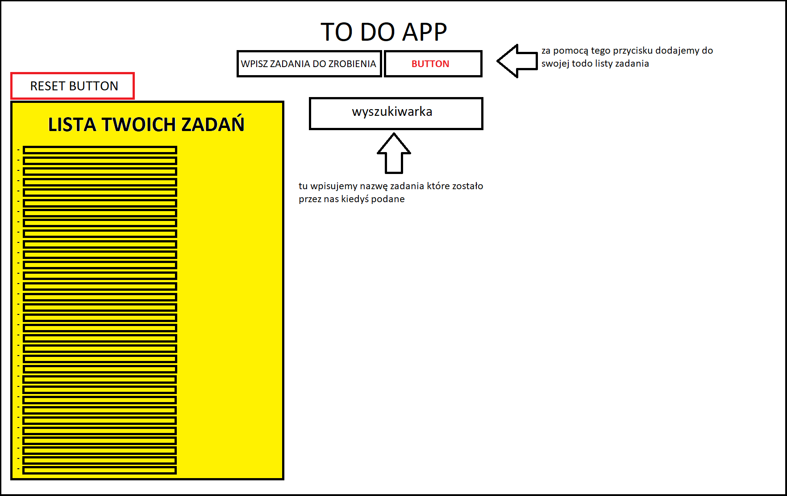

# ZALOZENIA
## główne cechy 

Aplikacja ma być uniwersalna, działać zarówno na telefonie jak i komputerze, powinna być ona ostylowana w css'ie (ładnie wyglądać), wchodząc na stronę powinien ukazać się nam input z zadaniem do wpisania oraz przycisk który będzie dodawał te zadanie do ToDoListy, każdy dodany elementy powinien posiadać również przycisk za którego pomocą będziemy wstanie go usunąć

## zabeczpieczenia 
aplikacja powinna być zabezpieczona przed wszelkimi próbami wpisania zadania o takiej samej nazwie jaka widnieje w ToDoLiscie 

## dodawanie elementów do listy
po dodaniu zadanie do naszej listy, powinno się ono zapisywać w liście li. takiej jak np ta:
 * zadanie 1
 * zadanie 2
 * zadanie 3

 lista ta na późniejszym etapie tworzenia zostałaby przekształcona w tablice, dla łatwiejszych operacji z wyszukiwnaiem nazw lub poszczegolnych znaków... Zaraz po dodaniu pierwszego zadania aplikacja powinna wyświetlić przycisk "RESET" odpowiadający za zresetowanie listy zadań

## szczegóły
zaraz po dodaniu zadania input powinien zostać wyczyszczony ze wcześniej wpisanej treści dla zachowania estetyki, elementy będą dodawać się liście ul 

 ## limity 
 aplikacja nie powinna mieć limitów co do ilości zadań, jedyny limit jaki powinna posiadać dotyczy dodania zadania o takiej samej nazwie

## wstępny koncept wyglądu aplikacji 

